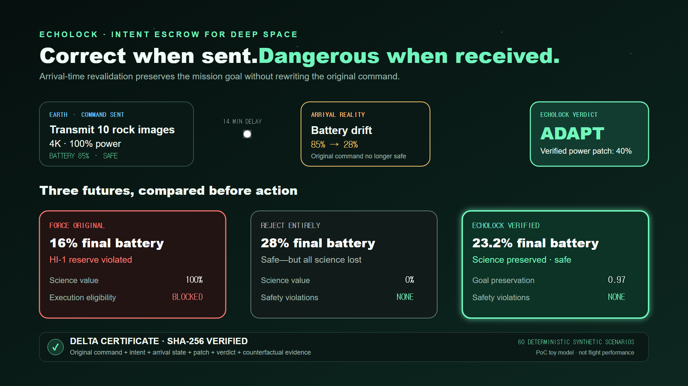
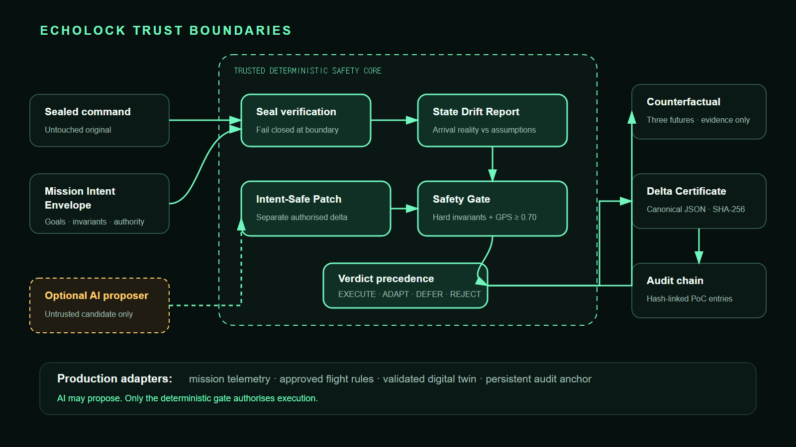

# EchoLock AI

> **A command can be correct when sent—and dangerous when received.**



Deep-space commands can arrive minutes after they leave Earth. By then, battery,
temperature, communications, or mission priorities may have changed. Conventional
execute-or-reject handling can either endanger the spacecraft or discard the
mission goal.

**EchoLock is an intent escrow for delayed commands.** It seals the original
command, revalidates its assumptions against arrival-time state, and produces one
of four deterministic, auditable decisions: `EXECUTE`, `ADAPT`, `DEFER`, or
`REJECT`. It never rewrites the original command; a safe alternative is attached
as a separately authorised and verifiable Intent-Safe Patch.

```text
Problem              Decision                 Evidence
command ages  ->  arrival-time recheck  ->  three futures compared
in transit        EXECUTE / ADAPT /          + Delta Certificate
                  DEFER / REJECT              + hash-linked audit
```

## The judge moment

Send the same imaging command twice. In the first reality it executes. In the
second, the battery falls during a 14-minute delay. Forcing it violates the
20% reserve; rejecting it loses all science. EchoLock applies a verified lower-power
transmission plan that preserves mission value without crossing the safety floor—and
binds the decision to a SHA-256 Delta Certificate.



## Why this is different

> **Most autonomy asks whether the spacecraft is healthy. EchoLock asks whether a
> once-correct command is still valid—and preserves its intent when it is not.**

The Mission Intent Envelope holds the command goal, assumptions, hard invariants,
and authorised adaptation boundaries. The Counterfactual Predictor places three
outcomes side by side: force the original, reject everything, or apply the verified
EchoLock action. The predictor explains the decision; it cannot override the
deterministic Safety Gate.

## Run the local judge demo

Python 3.11 or later is required.

```bash
python -m pip install -e ".[dev]"
python -m uvicorn echolock.webapp:app --host 127.0.0.1 --port 8000
```

Open `http://127.0.0.1:8000/`, choose each arrival reality, and inspect:

- the `EXECUTE`, `ADAPT`, `DEFER`, or `REJECT` decision;
- the original-command seal and separate Intent-Safe Patch;
- force-original vs reject-entirely vs EchoLock counterfactuals;
- certificate and semantic replay verification;
- the in-memory hash-linked audit trace.

| Endpoint | Purpose |
|---|---|
| `/health` | Local readiness check |
| `/api/scenarios` | Four canonical demo scenarios |
| `/api/scenarios/{seed}` | Run one complete scenario |
| `/api/evaluation` | Phase 2 evaluation summary |
| `/api/audit` | Current audit-chain snapshot |

## Deterministic synthetic benchmark

These results come from **60 fixed, balanced, synthetic PoC scenarios**—15
deliberately constructed examples per verdict. They validate deterministic logic
against this test set; they are **not estimates of performance on real missions,
flight telemetry, or an unknown operational distribution**.

| Metric | Synthetic result |
|---|---:|
| Safety violation rate | 0.00% |
| Unsafe-command interception recall | 100.00% |
| Safe-command false rejection rate | 0.00% |
| Mean goal-preservation score | 0.7195 |
| Mean battery margin above the 20% floor | 37.52 percentage points |
| Adaptation success rate | 100.00% |
| Deterministic replay consistency | 100.00% |

Machine-readable records are in [`outputs/evaluation/`](outputs/evaluation/).
Decision latency is host-dependent and is not part of replay equivalence.

## AI and IBM Bob: the honest boundary

IBM Bob was the principal AI development partner for the initial architecture and
core Phase 0/1 safety pipeline: domain schemas, command/MIE sealing, safety rules,
patch boundaries, tests, and the first vertical slice. Codex independently audited
and corrected Phase 1/1.1, then implemented Phase 2 and the local demo. Detailed
provenance is recorded in [`docs/bob-development-log.md`](docs/bob-development-log.md),
with redacted photographic evidence in
[`docs/evidence/ibm-bob/`](docs/evidence/ibm-bob/).

EchoLock deliberately keeps generative AI outside execution authority. A future
AI proposer may suggest patches or explanations, but every candidate must pass the
same deterministic invariants, goal-preservation threshold, seal checks, and
precedence rules. The current PoC does not claim an integrated flight AI model.

## Safety and integrity contract

- Post-execution battery must remain at or above 20%.
- Equipment temperature must remain at or below 75°C.
- The emergency beacon cannot be interrupted.
- Expired commands cannot execute.
- No adaptation may violate a hard invariant.
- Goal-preservation eligibility requires a deterministic score of at least 0.70.
- Command and MIE seals are verified at the pipeline boundary.
- The Delta Certificate hash covers every certificate field except itself.
- `semantic_replay_hash` matches equivalent decisions across fresh IDs and shifted timestamps.
- AI/LLM output never controls the deterministic Safety Gate.

## Reproduce the evidence

```bash
$env:PYTHONPATH = "$PWD/src"   # PowerShell when not installed editable
python -m pytest tests --tb=short -q --cov=src/echolock --cov-branch --cov-report=term-missing
python -c "from echolock.evaluation import write_results; from pathlib import Path; write_results(Path('outputs/evaluation'))"
```

The verified submission-preparation baseline passes **243/243 tests** with
**94.32% statement+branch coverage**. Fresh evaluation confirms 60/60 valid
certificate hashes and 60/60 valid semantic replay hashes.

## Known limitations and credible path to mission use

- Battery, thermal, and communications behavior are deterministic toy models,
  not flight-qualified physics or operational performance predictions.
- The predictor reports current temperature as maximum temperature; it does not
  model transmission heating or cooling during defer.
- The balanced synthetic dataset does not represent real mission prevalence.
- The audit chain is in memory. Production needs persistent storage and an
  externally anchored trusted head to detect tail truncation.
- No external LLM, mission telemetry integration, deployment, or hardware-in-the-loop
  validation is included.

The architectural contribution is the separation of intent, proposal, safety
authority, and proof. A production path replaces the toy predictor with a
mission-approved digital twin, imports flight rules into the policy engine, anchors
audit heads externally, and validates with recorded telemetry and hardware-in-the-loop
scenarios—without giving an AI model authority to bypass hard invariants.

See [`docs/architecture.md`](docs/architecture.md) for trust boundaries and
[`docs/submission/`](docs/submission/) for the evidence checklist, judge script,
and submission copy.
