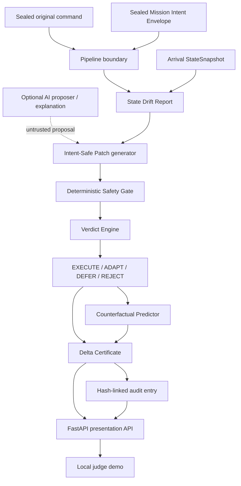
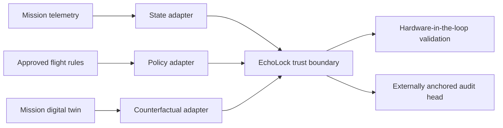

# EchoLock Architecture

## Design objective

EchoLock separates an operator's durable intent from a command that may become
unsafe during communication delay. The deterministic safety core remains the
only authority for execution eligibility; the UI and optional explanatory AI
are outside that trust boundary.

## Component flow

The dashed AI path is intentionally outside the execution trust boundary. The
current PoC uses the deterministic proposer; it does not claim an integrated
flight AI model. Any future AI candidate is treated as untrusted input.

## Trust boundaries

### Trusted deterministic core

- `command_sealer.py` and `mie_sealer.py` establish source integrity.
- `safety_gate.py` checks hard invariants and recomputes GPS without trusting a
  candidate-supplied score.
- `verdict_engine.py` applies the fixed five-step precedence.
- `certificate_builder.py` binds command, intent, state, patch, counterfactual,
  and verdict into a self-hashed certificate.
- `models.py` defines deep MIE immutability, canonical hashes, and audit-chain verification.

### Deterministic evidence layer

- `counterfactual.py` compares force-original, reject-entirely, and the verified
  EchoLock action. It explains outcomes but cannot override the Safety Gate.
- `evaluation.py` runs 60 fixed synthetic scenarios and emits reproducible
  non-latency metrics plus machine-readable artifacts.

### Untrusted presentation layer

- `demo_service.py` adapts the core models to judge-focused responses.
- `webapp.py` exposes local, read-focused FastAPI endpoints.
- `web/` renders scenario, counterfactual, certificate, and audit views.

Presentation code never issues a verdict itself. Every displayed decision comes
from the sealed deterministic pipeline, and every API scenario response includes
fresh certificate and semantic replay verification results.

## Decision precedence

1. `REJECT` immediately for expiry, failed integrity, inactive beacon, or
   unresolvable hard-invariant state.
2. `EXECUTE` when the original command is safe now.
3. `ADAPT` when an immediate authorised patch passes every invariant and GPS ≥ 0.70.
4. `DEFER` when a safe authorised opportunity exists before expiry.
5. `REJECT` when no valid option remains.

## Integrity model

`certificate_hash` covers canonical JSON for every Delta Certificate field except
the hash itself. It includes volatile identifiers, timestamps, source hashes,
the counterfactual bundle, and `semantic_replay_hash`. Any included-field change
invalidates it.

`semantic_replay_hash` excludes volatile IDs and absolute timestamps while
retaining semantic command, intent, state, patch, invariant, counterfactual, GPS,
and verdict content. Equivalent runs therefore match even when their object IDs
and wall-clock timestamps differ.

The audit entry hash covers its identity, certificate reference, timestamp,
payload, sequence, and previous-entry hash. The current PoC cannot detect removal
of the final entries without a separately persisted trusted head.

## Production extension path

The PoC's toy physics are replaceable adapters, not a claim of flight fidelity.
Operational feasibility requires mission-owned telemetry schemas, approved flight
rules, a validated digital twin, persistent audit anchoring, and hardware-in-the-loop
testing. The sealed intent, candidate-authority boundary, deterministic gate, and
evidence contract remain unchanged.
